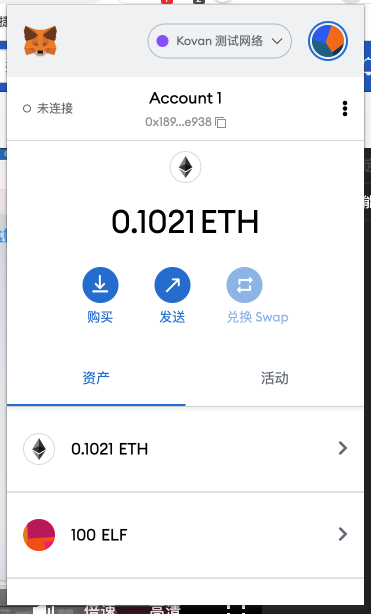

W1-1作业：
* 安装 Metamask、并创建好账号

* 执行一次转账
https://kovan.etherscan.io/tx/0xac52bfade33d2af1897d4ab9471192aa0067f448566d5c89cc55874036b4cd86

* 使用 Remix 创建任意一个合约
https://kovan.etherscan.io/tx/0x8050253e925613a1a7fb89078e962b48711d5cf10f857c809faccae5b76c6257

* VSCode IDE 开发环境配置

* 使用 Truffle 部署 Counter 合约 到 test 网络（goerli）（提交交易 hash）
> 部署到kovan了
https://kovan.etherscan.io/tx/0x42c8744ef6d69e32daabf23dfac3781f7a4aa3c9183f34d5c0bf353ebb30d699
* 编写一个测试用例
test_js:[counter-test.js](/w1/w1-1/test/counter-test.js)

W1-2作业：
* 使用Hardhat部署修改后的Counter
* 使用Hardhat测试Counter
* 写一个脚本调用count()

作业要求：
1. 使用自己的 github 创建一个作业代码库
2. 每一次作业使用一个文件夹(w1) 
3. 提交代码、截图、交易 hash 等